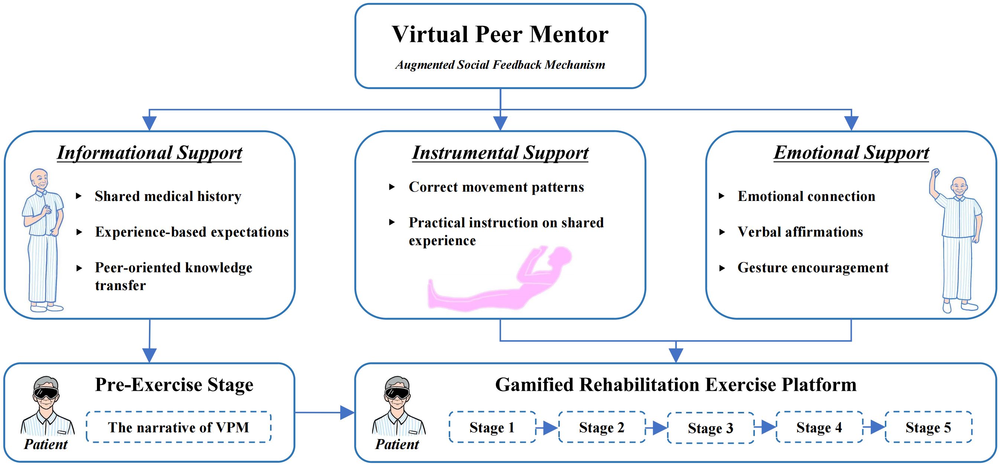
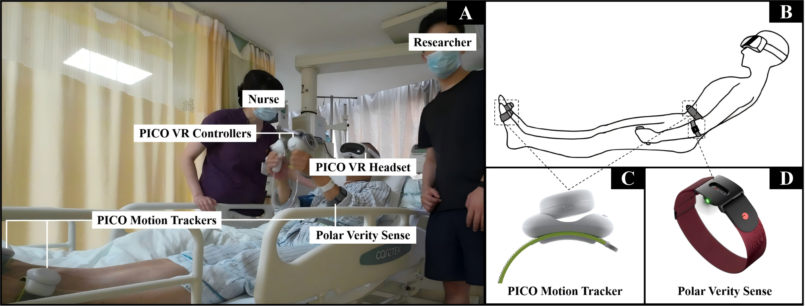

# A VR Rehabilitation Game for Heart-Attack Patients

[](https://unity.com/)
[](https://www.picoxr.com/)
[](LICENSE)

> **IEEE VR 2026 Paper** > A Virtual Peer Mentor to Enhance Social Presence in VR Rehabilitation for Recovering Heart-Attack Patients  
> **Authors:** Renzhi Han, Boon Giin Lee, Dave Towey, Yuan Yao, Matthew Pike

---

## 📖 Introduction

This is an immersive virtual reality (IVR) rehabilitation game designed to support early-phase cardiac rehabilitation for patients recovering from acute myocardial infarction (AMI). 

Grounded in social support theory, this project introduces a virtual peer mentor (VPM), a virtual companion who simulates a shared recovery journey. The VPM provides informational, instrumental, and emotional support to alleviate patient stress, reduce loneliness, and enhance engagement during rehabilitation exercises.

The game features a gamification platform on *gradual healing*, where repetitive rehabilitation movements are transformed into meaningful game tasks to protect a health crystal.


*Figure 1: Overview of the system architecture of the cardiac rehabilitation game integrated with VPM.*

---

## ✨ The Virtual Peer Mentor

The VPM delivers three distinct forms of social support to the patient.


*Figure 2: The VPM delivers support via (A) Narrative Mode, (B) Guidance Mode, and (C) Companion Mode.*

### 1. Informational Support (Narrative Mode)
* **Context:** Pre-exercise phase.
* **Function:** The VPM appears as a recovered peer, sharing a shared medical history and success stories. This narrative helps manage patient expectations and builds confidence by showing that recovery is achievable.

### 2. Instrumental Support (Guidance Mode)
* **Context:** During gameplay/exercise.
* **Function:** The VPM transforms into a translucent pink silhouette to demonstrate clinically validated movements as visual guidance in real-time.

### 3. Emotional Support (Companion Mode)
* **Context:** During gameplay/exercise.
* **Function:** The VPM stands beside the patient as a supportive companion, providing verbal affirmations and positive gestures to reinforce motivation and reduce psychological tension.

---

## 🎮 Gamified Rehabilitation Platform

The gamified rehabilitation platform has a progressive narrative consisting of five stages. Each stage targets specific body movements.


*Figure 3: The five stages of the "gradual healing" game mapped to specific rehabilitation exercises.*

### Stage Breakdown

| Stage | Game Narrative | Rehabilitation Exercise | Target Movement |
| :--- | :--- | :--- | :--- |
| **1** | **Intrusion Defense** | Arm Exercises | 60° Vertical Raise |
| **2** | **Element Elimination** | Shoulder Exercises | 30 cm Circular Motion |
| **3** | **Energy Tide** | Ankle Pumps | 45° Flexion |
| **4** | **Energy Balance** | Leg Raising | 45° Elevation |
| **5** | **Health Resonance** | Glute Bridges | 10 cm Lift |

---

## ⚙️ System Requirements

This project was developed and validated using the following setup:

### Hardware
* **VR Headset:** PICO 4 Ultra (90 Hz refresh rate, 2160x2160 resolution per eye)
* **Controllers:** PICO VR Controllers (6 DoF)
* **Motion Tracking:** 3x PICO Motion Trackers (positioned on the waist and both feet)
* **Bio-signals:** Polar Verity Sense Optical Heart Rate Sensor (Armband)


*Figure 4: Experimental setup showing the patient equipped with VR headset and motion trackers.*

### Software
* **Engine:** Unity 3D Editor **v6000.0.43f1**
* **SDK:** PICO Unity Integration SDK

---

## 📚 Citation

```bibtex
@inproceedings{han2026vpm,
  title={A Virtual Peer Mentor to Enhance Social Presence in VR Rehabilitation for Recovering Heart-Attack Patients},
  author={Han, Renzhi and Lee, Boon Giin and Towey, Dave and Yao, Yuan and Pike, Matthew},
  booktitle={2026 IEEE Conference on Virtual Reality and 3D User Interfaces (VR)},
  year={2026},
  organization={IEEE}
}
